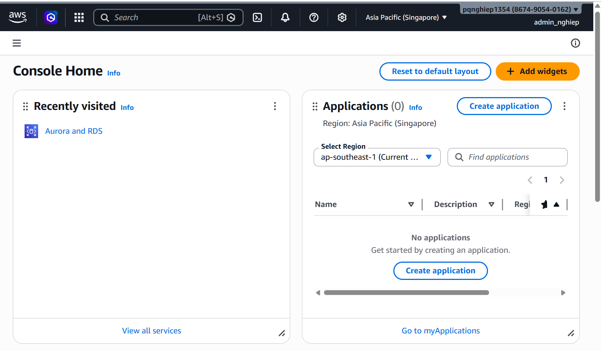
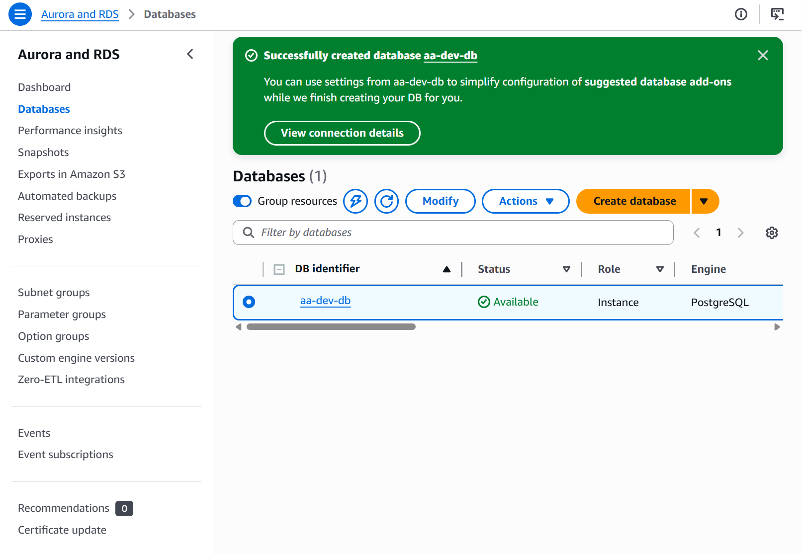
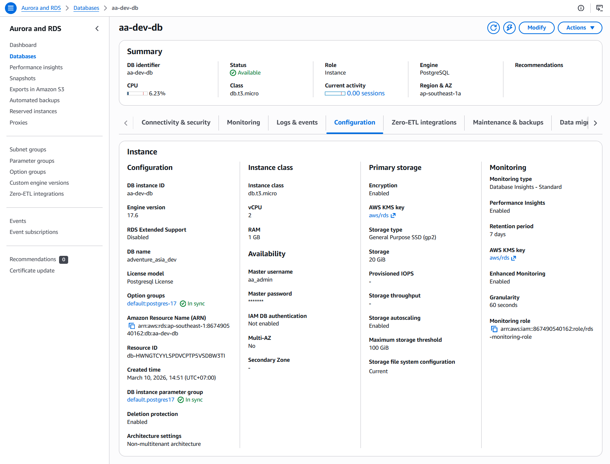
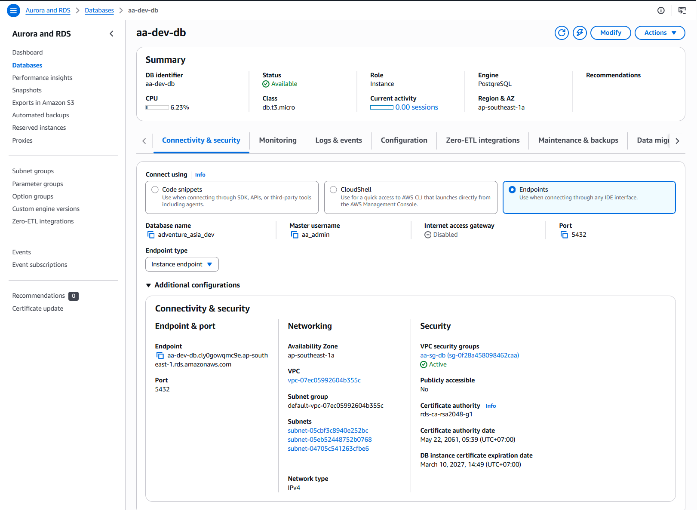

# AA AWS Practice - Nghiep

**Project:** Adventure Asia App (AAA)
**Mentor:** Shivam (QuanSkill DevOps Lead)
**Program:** DevOps Mentorship — Session 2+
**AWS Account Type:** Demo / Practice account
**Region:** `ap-southeast-1` (Singapore)
**IAM User:** `admin_nghiep`

---

## 📋 Progress Tracker

| Step   | Title                              | Status     | Date Completed |
| ------ | ---------------------------------- | ---------- | -------------- |
| Step 0 | Pre-Checks & Documentation Setup   | ✅ Complete |                |
| Step 1 | IAM & Access Discipline            | ✅ Complete |                |
| Step 2 | Cost Visibility & Guardrails       | ✅ Complete |                |
| Step 3 | Networking — VPC & Security Groups | ✅ Complete |                |
| Step 4 | Storage — S3 Bucket                | ✅ Complete |                |
| Step 5 | Database — RDS Concept             | ✅ Complete |                |
| Step 6 | Secrets & Configuration            | ✅ Complete |                |
| Step 7 | Monitoring — CloudWatch            | ✅ Complete |                |
| Step 8 | CI/CD & Release Workflow Blueprint | ✅ Complete |                |

---

---

## Step 0 — Pre-Checks & Documentation Setup

**Date:** 10/03/2026
**Time spent:** 15-20 minutes

### Decisions Made

- Selected region `ap-southeast-1` (Singapore) because it is the closest region to Adventure Asia's primary markets — Vietnam, Thailand, Indonesia — minimising latency for mobile app users. Additionally, this is the region that will be used in the actual client account, so practising here helps build familiarity with the right environment.
- Used the Default VPC for practice instead of creating a new custom VPC to save time. A real production setup will require a custom VPC with separate public/private subnets — this will be studied in depth in a later sprint.
- Decided to name the screenshot folders using the format `step-X/X.Y_description.png` so they are easy to locate and submit in a well-structured report.

### Screenshots Taken

- [ ] Screenshot 0.1 — AWS Console Home with the region selector showing `ap-southeast-1 (Singapore)`


### Issues Encountered

- When accessing the AWS Console for the first time, had to figure out how to switch regions — the region selector is in the top-right corner of the navigation bar; click the current region name to open the dropdown.

### Questions for Mentor

- Besides `ap-southeast-1`, does the AAA project use any other regions? For example, `us-east-1` for AWS services that are only available in the US (such as certain IAM global services)?
- In the actual client account, is AWS Organizations used with multiple accounts (e.g. a dedicated account for production), or do all environments share the same account?

### Notes

```
Region chosen   : ap-southeast-1 (Singapore)
Reason          : Closest region to AAA's primary markets (VN, TH, ID)
VPC used        : Default VPC — vpc-xxxxxxxxxx (fill in after confirming)

Tagging standard applied to all resources:
  Project   = AdventureAsia
  Owner     = Nghiep
  Env       = dev
  Component = [per resource]

Folder structure created on local machine:
  ../AAA-AWS-Practice/
  ├── screenshots/step-0/ through step-8/
  └── AA AWS Practice - Nghiep.md  (this file)
  └──
```

---

## Step 1 — IAM & Access Discipline

**Date:** 10/03/2026
**Time spent:** 20-30 minutes

### Decisions Made

- Enabled MFA on the `admin_nghiep` user using Google Authenticator rather than a hardware token because this is a demo account — a hardware token is more appropriate for the production root account.
- Applied 4 ReadOnly policies to the `aa-devops` group instead of broader policies, following the **least privilege** principle: at the practice stage, only read access is needed, not the ability to make changes. As responsibilities are added by the mentor, permissions will be expanded incrementally.
- Created 2 roles with EC2 as the trusted entity because within AAA, EC2 instances (running the Laravel API) will need to assume these roles to access other AWS services — rather than using hardcoded access keys on the server.
- Named the roles using the `aa-role-[purpose]` convention to distinguish them from roles belonging to other projects that may exist in the same AWS account.

### Screenshots Taken

- [x] Screenshot 1.1 — MFA Assigned on user `admin_nghiep`


- [x] Screenshot 1.2 — Group `aa-devops` with user added


- [x] Screenshot 1.3 — Group `aa-devops` with 4 policies


- [x] Screenshot 1.4 — Both IAM Roles (`aa-role-readonly` and `aa-role-deploy-nonprod`)
.png>)

### Issues Encountered

- When adding MFA, two consecutive OTP codes are required (code 1, then code 2 after 30 seconds). Initially assumed only one code was needed and received an error. Resolution: read the form carefully — AWS requires 2 codes to verify the device is correctly time-synchronised.
- When searching for the `AmazonEC2ReadOnlyAccess` policy in the Create Group search box, typing "EC2Read" returned no results; typing "EC2ReadOnly" was needed to find the correct policy.

### Questions for Mentor

- In the actual client AWS account, does the GitHub Actions pipeline use an IAM User with static access keys (stored in GitHub Secrets), or does it use GitHub OIDC to assume an IAM Role without long-lived credentials? Which approach is currently in use for AAA?
- For the `aa-devops` group in a real environment, beyond ReadOnly access, what additional permissions will I need to support staging deployments and configure monitoring as required by the SOW?
- `aa-role-deploy-nonprod` currently has `AmazonEC2FullAccess` and `AmazonS3FullAccess`. In a production setup, how would we restrict this using a custom policy? For example, allowing access only to S3 buckets with the prefix `aa-dev-*` and `aa-stg-*`?

### Notes

```
MFA Device      : admin_nghiep-mfa (Authenticator app)
MFA Status      : Assigned ✓
Tested login    : Signed out and signed back in successfully with OTP ✓

IAM Group       : aa-devops
Policies        :
  ✓ AmazonEC2ReadOnlyAccess
  ✓ AmazonRDSReadOnlyAccess
  ✓ AmazonS3ReadOnlyAccess
  ✓ CloudWatchReadOnlyAccess
User in group   : admin_nghiep ✓

Role 1: aa-role-readonly
  Trusted entity : EC2
  Policy         : ReadOnlyAccess
  Use case       : Monitoring and audit — EC2 instances assume this role
                   to call the CloudWatch API without needing access keys

Role 2: aa-role-deploy-nonprod
  Trusted entity : EC2
  Policies       : AmazonEC2FullAccess, AmazonS3FullAccess
  Use case       : Deployment operations on dev/staging environments
  Note           : In production, will be replaced with a custom policy
                   restricted to non-prod resources only
```

### Production Access Rules

1. Production changes require explicit written approval from Shivam before any action is taken — no exceptions, including urgent hotfixes.
2. No developer or team member has direct access to the Production database. Only the EC2 application server IAM Role can connect to RDS on port 5432.
3. IAM permission changes in any environment require Shivam's review before execution — no self-service permission escalation.
4. All production credentials (DB passwords, JWT secrets, API keys) are stored only in AWS Secrets Manager and GitHub Secrets — never in chat, email, documents, or code.
5. Any emergency direct action taken on Production must be documented within 1 hour: what was done, why it was necessary, what the outcome was, and reported to Shivam immediately.

---

## Step 2 — Cost Visibility & Guardrails

**Date:** 10/03/2026
**Time spent:** 15-20 minutes

### Decisions Made

- Set the budget limit at $10 USD/month because this is a demo account used solely for practice — large resources are not needed. The 50% alert threshold ($5) provides an early warning while there is still time to clean up before the limit is reached.
- Used the "Monthly cost budget" template instead of creating a custom budget because it is simple and sufficient for practice purposes. Custom budgets are more useful when tracking costs per specific service (EC2 only, RDS only) — this will be explored in a later sprint.
- Created the cleanup checklist at the very start and committed to running it AFTER EVERY session rather than waiting until the end of the project — because AWS charges by the hour even when resources are idle (idle EC2, idle RDS).

### Screenshots Taken

- [ ] Screenshot 2.1 — AWS Budgets → Budget `aa-practice-monthly` → summary page showing 2 alert thresholds ($5 and $10) with email configured


### Issues Encountered

- After creating the budget, an email was received from AWS SNS asking to confirm the subscription. If "Confirm subscription" is not clicked in the email, alerts will NOT be sent even though the budget has been created. This is an easy step to overlook.
- When accessing Billing for the first time, AWS requires "IAM user access to billing" to be activated from the root account. This requires logging in as root → Account settings → Activate IAM access → after which IAM users can access Billing.

### Questions for Mentor

- In the actual client account, are cost allocation tags currently in use? Is it possible to view a cost breakdown by environment (staging vs. production) in Cost Explorer?
- Are EC2 and RDS using Reserved Instances or Savings Plans to reduce costs? If not, is this a worthwhile improvement to propose?
- When is AWS Budgets sufficient, and when should the team move to AWS Cost Anomaly Detection?

### Notes

```
Budget name         : aa-practice-monthly
Budget amount       : $10.00 USD / month
Alert 1             : 50% threshold ($5.00) — email: [your-email]
Alert 2             : 100% threshold ($10.00) — email: [your-email]
SNS Topic           : aws-budgets-sns-topic (auto-created)
Email confirmed     : ✓ (clicked "Confirm subscription" in the AWS email)
Budget type         : Cost budget (monthly)
```

### Cleanup Checklist (run after every practice session)

- [ ] Terminate EC2 instances: EC2 → Instances → Select → Instance State → **Terminate** (not just Stop)
- [ ] Delete RDS instance if created: RDS → Databases → Actions → Delete → uncheck "Create final snapshot"
- [ ] Empty and delete S3 bucket: S3 → bucket → **Empty** first → then **Delete bucket**
- [ ] Delete Security Groups: VPC → Security Groups → Delete (only when no instances are attached)
- [ ] Delete CloudWatch alarms: CloudWatch → Alarms → Select → Actions → Delete
- [ ] Release Elastic IPs: EC2 → Elastic IPs → Select → Release
- [ ] Verify billing: Billing → Bills → Current Month → confirm there are no unexpected charges

---

## Step 3 — Networking — VPC & Security Groups

**Date:** 10/03/2026
**Time spent:** 20-30 minutes

### Decisions Made

- Used the Default VPC instead of creating a custom VPC because the goal of this step is to learn Security Groups and traffic rules, not VPC architecture. Custom VPC will be studied in a later phase once the fundamentals are solid.
- Set the SSH rule (port 22) source to "My IP" rather than `0.0.0.0/0` because an open SSH source would be subject to continuous brute force attacks. In production, SSH access is restricted further — only through AWS Systems Manager Session Manager, with port 22 not exposed externally at all.
- Created `aa-sg-db` with the source set to the Security Group ID of `aa-sg-app` (not an IP range), because when an EC2 instance is replaced (auto scaling, deployment), its IP changes but the Security Group ID does not. Using an SG-to-SG reference ensures the rule remains correct.
- Added a clear description to each inbound rule (e.g. "HTTPS from all users - mobile app and web") so that anyone reading it later understands the purpose of the rule without having to guess.

### Screenshots Taken

- [ ] Screenshot 3.1 — VPC → Security Groups → `aa-sg-app` → **Inbound rules** tab (showing 3 rules: 443, 80, 22 with correct sources)
.png>)

- [ ] Screenshot 3.2 — VPC → Security Groups → `aa-sg-db` → **Inbound rules** tab (showing port 5432 with source `sg-xxxxxxxxxx (aa-sg-app)`, NOT `0.0.0.0/0`)


### Issues Encountered

- When creating the rule for `aa-sg-db`, the Source field has a dropdown — "Custom" must be selected and then `sg-` typed to search by Security Group ID. Selecting "Anywhere-IPv4" populates `0.0.0.0/0` — which is a critical security vulnerability for a database port.
- `aa-sg-app` must be created FIRST before creating `aa-sg-db`, because `aa-sg-db` needs to reference the Security Group ID of `aa-sg-app`. Doing it in reverse order means there is no SG ID available to enter in the rule.

### Questions for Mentor

- In the actual AAA setup, is there a Load Balancer (ALB) in front of EC2? If so, the EC2 Security Group would no longer receive traffic directly from the internet — the source for rule 443 would be the ALB's Security Group rather than `0.0.0.0/0`. What is the current client setup?
- Do WebSocket connections from the mobile app (used for real-time journey tracking and chat) go through the same port 443 as the REST API, or is a separate inbound rule needed?
- When the EC2 app server needs to make outbound calls to the internet (e.g. calling an external payment API, Google Maps API) from a Private Subnet, is a NAT Gateway required? How does the current AAA setup handle this?
- If direct database access is needed for emergency debugging when the DB is in a private subnet, how is this achieved? SSH tunnel via EC2, or AWS Systems Manager Session Manager?

### Notes

```
VPC used        : Default VPC — vpc-xxxxxxxxxx (fill in after checking console)
VPC CIDR        : 172.31.0.0/16 (default AWS VPC CIDR)

Security Group  : aa-sg-app
SG ID           : sg-xxxxxxxxxx (fill in after creation)
Inbound Rules   :
  HTTPS 443 from 0.0.0.0/0       — All users, mobile app and web
  HTTP  80  from 0.0.0.0/0       — HTTP, redirect to HTTPS
  SSH   22  from x.x.x.x/32      — Emergency access, my IP only
                                    My current IP: [check at whatismyip.com]

Security Group  : aa-sg-db
SG ID           : sg-xxxxxxxxxx (fill in after creation)
Inbound Rules   :
  PostgreSQL 5432 from sg-xxxxxxxxxx (aa-sg-app)
  ⚠️ Source MUST be SG ID, NOT 0.0.0.0/0
```

### Traffic Path Diagram

```
USER (Mobile App / Web Browser)
        │
        │ HTTPS port 443 (encrypted TLS)
        ▼
AWS INTERNET GATEWAY
        │
        │ enters VPC 172.31.0.0/16
        ▼
┌─────────────────────────────────────────────┐
│ PUBLIC SUBNET                               │
│                                             │
│  EC2: aa-dev-api (Laravel API Server)       │
│  Security Group: aa-sg-app                  │
│    ✓ ALLOWS IN  : 443 from internet         │
│    ✓ ALLOWS IN  : 80  from internet         │
│    ✓ ALLOWS IN  : 22  from [my IP] only     │
│    ✗ BLOCKS ALL : other ports               │
└──────────────────┬──────────────────────────┘
                   │
                   │ PostgreSQL port 5432
                   │ (internal traffic only)
                   ▼
┌─────────────────────────────────────────────┐
│ PRIVATE SUBNET                              │
│                                             │
│  RDS: aa-dev-db (PostgreSQL 15)             │
│  Security Group: aa-sg-db                   │
│    ✓ ALLOWS IN  : 5432 from aa-sg-app only  │
│    ✗ BLOCKS ALL : 5432 from internet        │
│    ✗ BLOCKS ALL : 5432 from my laptop       │
│    ✗ BLOCKS ALL : everything else           │
└─────────────────────────────────────────────┘

Conclusion: The database CANNOT be connected to directly
from the internet. Only the EC2 app server is permitted
to connect to the database.
```

---

## Step 4 — Storage — S3 Bucket

**Date:** 10/03/2026
**Time spent:** 20-25 minutes

### Decisions Made

- Enabled **Versioning** from the outset because if someone accidentally overwrites an important file (e.g. replacing a tour photo with a corrupted file), versioning allows restoration to a previous version. The marginal cost increase is far outweighed by the insurance value.
- Used **ACLs disabled** (Object Ownership) rather than ACL-based access control because this is the current AWS recommended practice. Access control is managed via IAM policies and bucket policies — simpler and more consistent.
- Organised folders by **content type** (`uploads/`, `images/`, `documents/`, `exports/`) rather than by user or date, because this allows different access policies to be applied to each type (e.g. `images/` can be served via public CloudFront, while `uploads/` remains completely private).
- Bucket name: `aa-dev-media-nghiep` — the name was appended because S3 bucket names must be globally unique across all of AWS, not just within the account.

### Screenshots Taken

- [x] Screenshot 4.1 — S3 bucket Properties (Block Public Access)
.png>)

- [x] Screenshot 4.2 — S3 bucket Properties (Versioning = Enabled)
.png>)

- [x] Screenshot 4.3 — S3 bucket Objects (4 folders)
.png>)

- [x] Screenshot 4.4 — S3 bucket Objects (test file at `uploads/`)


### Issues Encountered

- When creating a folder in S3, the folder name must not have a leading or trailing `/` — S3 automatically appends `/` to the end when displaying. The correct entry is `uploads`, not `/uploads/`.
- The bucket must be **Emptied first** before it can be deleted. If objects still exist in the bucket, deletion will fail. Correct order: Empty → Delete bucket.

### Questions for Mentor

- Tour photos and destination images need to be displayed publicly in the mobile app — is AAA currently serving these directly from S3 (public bucket) or via CloudFront CDN? A public S3 bucket is an anti-pattern in terms of both security and performance.
- For user-uploaded files (booking documents, passport scans), is the Laravel application generating presigned URLs for downloads, or serving files directly via the API? What is the expiry time for the presigned URLs?
- Are any Lifecycle policies currently applied? For example, are `exports/` files older than 90 days automatically moved to Glacier or deleted?
- Is S3 access logging enabled? If a customer reports that their data was accessed without authorisation, would it be possible to trace the access?

### Notes

```
Bucket name     : aa-dev-media-nghiep
Region          : ap-southeast-1
Block Public    : ✓ All 4 options enabled
Versioning      : ✓ Enabled
Object Ownership: ACLs disabled (recommended)
Encryption      : SSE-S3 (AWS managed keys, default)

Folder structure:
  uploads/    → User uploads: booking docs, passport scans (Private)
  images/     → Tour photos, destination images (via CloudFront)
  documents/  → PDF brochures, itineraries (Presigned URL)
  exports/    → System-generated receipts, reports (90-day retention)

Test file       : uploads/test-upload.txt ✓
```

### Why Block Public Access is Enabled

Adventure Asia handles sensitive customer data including booking documents, passport scans, and financial receipts. If the S3 bucket were public, anyone who guesses or discovers a file URL could read private customer documents — a serious privacy and compliance violation.

The correct pattern for AAA is: the S3 bucket stays private (Block Public Access fully ON), and the Laravel API generates time-limited presigned URLs when an authorised user needs to download their specific file. For tour images that do need to be publicly visible in the app, they are delivered via CloudFront CDN rather than directly from S3 — this adds a controlled delivery layer and improves performance globally.

This also means that even if someone obtains the S3 bucket name, they cannot list or access any files without proper IAM authorisation.

---

## Step 5 — Database — RDS Concept

**Date:** 10/03/2026
**Time spent:** 20-30 minutes

### Decisions Made

- Chose **Option A (Amazon RDS (Relational Database Service) created)**
  1. RDS instance aa-dev-db created, status = Available
  2. Public accessibility = No ← verified
  3. Security Group = aa-sg-app ← verified
  4. Automated backups = Enabled
Issues Encountered:
- Created RDS instance aa-dev-db for hands-on practice.
- Deleted immediately after — Option A confirmed, now reverting to Option B

- Chose **Option B (Planning checklist only)** — did not create an actual RDS instance because:
  1. RDS db.t3.micro costs ~$0.017/hour ≈ approximately $12/month if left running continuously
  2. The mentor already has an RDS instance on the client account available for demonstration during the session
  3. The primary goal is to understand operational requirements, not necessarily to create a new instance
  4. Real RDS practice will be done once access to the staging environment is assigned
- If creating: **Public accessibility must be set to No** — this is a non-negotiable setting. The database must never accept direct connections from the internet.
- Multi-AZ will not be enabled for dev/staging (to save costs) but is mandatory for production (automatic failover when the primary instance encounters a problem).

### Screenshots Taken

- [ ] Screenshot 5.1-5.3 — RDS created (Option A)
 
 


### Issues Encountered

- While researching RDS settings, discovered that the default value of `Publicly accessible` depends on the template selected. The "Free tier" template defaults to `No`, but the "Production" template may default differently. Lesson: always verify this setting after creation — never assume the default is correct.
- The `max_connections` value in PostgreSQL depends on the instance's RAM: db.t3.micro (~87 connections), db.t3.small (~172 connections). If the application creates a connection pool that is too large, a `too many connections` error will occur.

### Questions for Mentor

- Is the AAA RDS instance currently using Multi-AZ? If the primary instance experiences a hardware failure, how long does failover take, and will the application automatically reconnect?
- Do database migrations in AAA run automatically on application startup (like Sequelize sync or Flyway) or as a separate step in the CI/CD pipeline? If they run automatically and multiple EC2 instances start simultaneously, is there a risk of a race condition?
- Is the application connecting using the master user (`aa_admin`) or has a separate application user been created with limited permissions? If the master user is being used, this is a security risk that should be addressed.
- What is the current backup retention period? And has anyone actually tested a restore from backup (not just assumed that backups are working)?

### Notes — DB Setup Checklist (10 items)

- [x] **Engine:** PostgreSQL 15.x — must match the development environment to avoid version incompatibility
- [x] **Subnet:** Private subnets only — never place RDS in a public subnet
- [x] **Public accessibility:** `No` — mandatory, non-negotiable, always verify after creation
- [x] **Security Group:** `aa-sg-db` — allows port 5432 from `aa-sg-app` only, not from the internet
- [x] **Credentials:** Stored in AWS Secrets Manager with key `aa/dev/db_credentials` — never hardcoded in code or env files
- [x] **Automated backups:** Enabled — 7-day retention for dev/staging, 30-day for production
- [x] **Backup window:** 02:00–04:00 UTC — low-traffic period (approximately 9–11 AM Vietnam time)
- [x] **CloudWatch alarm:** `DatabaseConnections > 80% of max_connections` — alert before connections are exhausted
- [x] **CloudWatch alarm:** `FreeStorageSpace < 5 GB` — alert before disk is full
- [x] **Separate DB per environment:** `aa-dev-db`, `aa-stg-db`, `aa-prod-db` — never share a single database across multiple environments

### Key Knowledge — RDS Operations

```
The most dangerous RDS mistakes are:
1. Public accessibility = Yes → database exposed to the internet
2. Using the master user for the application
   (a dedicated app user with minimal permissions should be created instead)
3. Not testing backup restore
   (the existence of a backup does not mean it can be restored successfully)
4. Running migrations directly on production without a rollback plan
5. Not setting deletion protection → someone accidentally deletes the DB
   → data is permanently lost

The application user should be created separately with only:
  GRANT SELECT, INSERT, UPDATE, DELETE ON ALL TABLES IN SCHEMA public TO aa_app_user;
  (No CREATE TABLE, DROP TABLE, or ALTER TABLE in production)
```

---

## Step 6 — Secrets & Configuration

**Date:** 10/03/2026
**Time spent:** 20-25 minutes

### Decisions Made

- Used **Key/value pairs** rather than plaintext format when creating the secret because the structure is clearer — the Laravel SDK can parse it directly into an object without additional parsing.
- Named secrets following the `aa/[env]/[purpose]` pattern because it creates a clear namespace: IAM policies can be scoped by environment (e.g. the dev team can only read `aa/dev/*`, not `aa/prod/*`).
- Disabled automatic rotation for practice — in production, rotation will be enabled with a Lambda rotation function. Automatic rotation reduces risk in the event of an undetected credential leak.
- Screenshots must capture the **name and ARN only** — scroll below the "Secret value" section before taking any screenshot. This is an absolute rule.

### Screenshots Taken

- [ ] Screenshot 6.1 — Secrets Manager → secret `aa/dev/db_credentials` → detail page showing name, ARN, description, tags only — **NO values visible**


### Issues Encountered

- When creating a secret for the first time, AWS defaults to suggesting "Credentials for Amazon RDS database" — this should NOT be selected for practice as it adds extra fields that are not needed. Choose "Other type of secret" to have full control over key/value pairs.
- The secret name must be `aa/dev/db_credentials` (using `/` as a path separator) — AWS allows forward slashes in secret names; this is the convention for creating a hierarchical namespace.

### Questions for Mentor

- How is the Laravel application currently reading credentials — pulling from the Secrets Manager SDK at runtime, or having GitHub Actions inject them as environment variables at deploy time? Which approach is being used?
- If the JWT secret is rotated on production, all currently active users will be signed out immediately (because old tokens will no longer be valid). Does AAA have a plan to handle this without disrupting users?
- What IAM permissions does the secret rotation Lambda function require? After rotation, does the application need to be restarted to read the new secret, or does it read from Secrets Manager on every request?

### Notes

```
Secret name     : aa/dev/db_credentials
Secret ARN      : arn:aws:secretsmanager:ap-southeast-1:XXXX:secret:aa/dev/db_credentials-XXXXXX
                  (fill in actual ARN after creation)
Encryption      : aws/secretsmanager (default AWS managed key)
Rotation        : Disabled (practice) — production: enable with Lambda

Naming pattern for all AAA secrets:
  aa/dev/db_credentials      → PostgreSQL dev
  aa/stg/db_credentials      → PostgreSQL staging
  aa/prod/db_credentials     → PostgreSQL production
  aa/prod/jwt_secret         → JWT signing secret
  aa/prod/payment_api_key    → Payment gateway key
  aa/prod/maps_api_key       → Maps service API key
  aa/prod/email_smtp         → Email service credentials

IAM access pattern:
  Dev team   → can read aa/dev/* and aa/stg/*
  Ops team   → can read all secrets, including aa/prod/*
  App server → can read the specific secret for that environment
```

### Secrets Handling Rules (5 rules)

1. **NEVER commit secrets to Git.** Before every commit: `git diff --staged | grep -iE "password|secret|key|token"` — if there is any match, STOP and remove it from the code before committing. `.env` files must always be in `.gitignore` from day one of the project.

2. **NEVER share secrets via communication channels.** Slack, Teams, email, and shared documents are all UNSAFE because logs persist indefinitely. The correct approach: grant IAM access to Secrets Manager for the person who needs it — they read the value themselves without you sending it.

3. **All production secrets must be stored in AWS Secrets Manager** with a complete description, environment tags, and a rotation schedule. Access permissions should be reviewed quarterly.

4. **Rotate immediately if compromised.** If a secret is accidentally exposed (committed to Git, pasted in chat): Step 1 — rotate IMMEDIATELY (do not investigate first); Step 2 — check CloudTrail for any unauthorised access; Step 3 — document the incident and report to Shivam within 1 hour.

5. **The application reads secrets at runtime, not at build time.** The Laravel API calls the Secrets Manager SDK on startup. Never embed secrets in Docker images or build artifacts. Verify: run `printenv | grep -i password` on the server — if anything is returned, there is a problem that needs to be resolved.

---

## Step 7 — Monitoring — CloudWatch

**Date:** 10/03/2026
**Time spent:** 30-40 minutes

### Decisions Made

- The practice guide originally called for an EC2 CPU utilisation alarm, but no EC2 instance or RDS database was available in the demo account at this stage — provisioning one solely to create a screenshot would generate unnecessary cost and drift from the intended scope. After clarifying with the mentor, Option 1 (Billing Alarm) was chosen as an equivalent exercise that covers the full alarm creation workflow: metric selection, threshold configuration, SNS topic, and email confirmation.
- Used the EstimatedCharges metric under the Billing namespace rather than a service-specific metric. This metric is always available regardless of which AWS services are running, making it the most practical choice when no compute or database resources are active.
- Set the alarm threshold at $8 (80% of the $10 monthly budget) so that a warning is received while there is still time to investigate and clean up before the hard limit is reached. Alerting only at 100% would leave no reaction window.
- Used 1 out of 1 data points rather than 3 out of 3 because the EstimatedCharges metric updates only every 6 hours — waiting for 3 consecutive breaches would mean an 18-hour delay before the alarm fires, which defeats the purpose for a cost guardrail.
- Selected "Treat missing data as good" — if AWS has not yet published a Billing data point, the account is not actively incurring unexpected charges, so no alert is warranted.
- Created the SNS topic aa-dev-alerts rather than adding an email address directly to the alarm, because an SNS topic allows multiple subscribers to be added later (email, Slack webhook, PagerDuty, Lambda) without needing to modify each alarm individually. The same topic will be reused for EC2 and RDS alarms once those resources are provisioned.
- Before this alarm could be created, two prerequisite steps were required: (1) activating IAM user access to Billing from the root account, and (2) enabling CloudWatch Billing Alerts in Billing Preferences. Without both steps, the Billing namespace does not appear in CloudWatch at all.

### Screenshots Taken

- [ ] Screenshot 7.1 — CloudWatch → Alarms → aa-practice-billing-alert → detail page (metric EstimatedCharges, threshold > $8, SNS topic aa-dev-alerts all visible)


- [ ]  Screenshot 7.2 — Email from AWS SNS containing "AWS Notification — Subscription Confirmed" after clicking the confirmation link 
.png>)

### Questions for Mentor

- The guide for this step was designed around EC2 CPU metrics, but I did not have an EC2 instance available. I completed the step using a Billing alarm instead, which covers the same workflow (metric → threshold → SNS → email). Is this an acceptable substitute, or would you like me to provision a t3.micro instance and recreate the alarm using CPUUtilization?
- Are the Laravel API application logs being written to CloudWatch Logs automatically, or are they only stored on the EC2 instance's local disk? If the instance is replaced during a deployment, would the logs from the previous instance be lost?
- For WebSocket connections supporting real-time features — is there separate monitoring for the number of active connections? Memory leaks in WebSocket handling may not surface in CPU metrics but can eventually crash the application.
- When a CloudWatch alarm fires at 2 AM on a Saturday — who currently receives the alert, and what is the on-call process? Is there a defined escalation path if the first responder is unavailable?
- Is there already a CloudWatch Dashboard for the AAA environments? Would it be possible to review it before I create a new one, to avoid duplicating existing work?


### Post-Deployment Verification Checklist (8 steps)

**Deployment info:** Version: ___ | Environment: ___ | Deployed by: ___ | Time: ___

**Step 1 — PIPELINE (immediately)**
Verify that all jobs in GitHub Actions show a green checkmark. No step should report an error or be skipped unexpectedly. Review the deployment job log — no lines should contain "error" or "failed".

**Step 2 — HEALTH CHECK (within 2 minutes)**
Call the API health endpoint and verify it returns HTTP 200:
`curl -f https://[environment-domain]/health`
Response time must be under 500ms. Response body must contain `{"status": "ok"}` or equivalent.

**Step 3 — APPLICATION LOGS (within 5 minutes)**
Open the CloudWatch Log Group for the environment just deployed. Filter for the last 5 minutes. There should be no new ERROR-level log entries. No messages such as "database connection failed" or "unhandled exception". Normal INFO-level startup messages should be present.

**Step 4 — KEY METRICS (within 5 minutes)**
EC2 CPUUtilization must be within the normal range (below 60%). RDS DatabaseConnections must be stable, not continuously increasing. No CloudWatch Alarms should be in the ALARM state (red).

**Step 5 — SMOKE TESTS (within 10 minutes)**
Run through the most critical user flows: the login flow works, destination search returns results, the inquiry/booking page loads without errors, and the admin dashboard is accessible and functional. No pages should be blank or return a 500 error.

**Step 6 — DATABASE (if the release includes a migration)**
Check the pipeline log for the line "migration successful" or "X migrations applied". Spot-check: `SELECT COUNT(*) FROM destinations;` — the result should be reasonable. Perform an actual action to verify the application is reading and writing to the database correctly.

**Step 7 — MONITORING WINDOW (30–60 minutes)**
Re-check at +15 minutes: no error spike in logs. Re-check at +30 minutes: all metrics stable. Re-check at +60 minutes: no delayed issues (e.g. cache expiry causing a load spike, scheduled jobs running and generating errors).

**Step 8 — DOCUMENTATION**
Write a Change Log entry including: commit SHA or version number, deployment time, deployed by, approved by, any issues observed, and the final outcome as either SUCCESS or ROLLBACK with the reason. Notify the team in the designated channel.

---

## Step 8 — CI/CD & Release Workflow Blueprint

**Date:** 10/03/2026
**Time spent:** ___ minutes

### Decisions Made

- Defined the workflow in writing BEFORE setting up automation because automation cannot add business logic or approval requirements on its own. Without a clear definition of what is wanted, automation only creates a "fast bad process."
- Placed the approval gate at the Staging → Production transition rather than auto-deploying both, because Production affects real users and real bookings — it cannot be left to the pipeline to decide when to deploy automatically.
- Based the rollback rules on specific, observable criteria (health check failing for 5 minutes, error rate increasing by 200%) rather than "if a problem is noticed," to avoid confusion and delays during an actual incident.
- The Change Log template includes enough fields to allow full traceability during a future audit — who changed what, when, and who approved it.

### Screenshots Taken

*(No screenshots required — this step is documentation work)*

### Issues Encountered

- While writing the rollback plan, it became apparent that if a release includes a database migration (e.g. ADD COLUMN), rolling back is not as simple as redeploying the old code, because the old code is incompatible with the new schema. A separate rollback migration (DROP COLUMN) must be written before deployment. This is an important point to discuss further with the mentor.

### Questions for Mentor

- When rolling back production — is the current mechanism a git revert followed by a redeploy, or redeploying the Docker image/artifact from the previous version? How long does an actual rollback take in practice?
- Is there a defined maintenance window for production deployments, or does the system require 24/7 availability with zero-downtime deployments?
- For database migrations that cannot be rolled back (e.g. DROP COLUMN, data transformation) — is AAA currently using the expand-contract pattern, or are these deployments done with downtime?
- In the SOP I wrote — are there any gaps or anything that does not align with the actual practices of the AAA project?

---

## 📤 Submission Checklist — Deliverables for Mentor

### Documents to Submit

- [x] **Deliverable 1** — Architecture-to-DevOps Component Map (Step 8)
- [x] **Deliverable 2** — Environment Plan v1 (4 environments + rules + access table)
- [x] **Deliverable 3** — AWS Readiness Checklist v1 (completed with current status)
- [x] **Deliverable 4** — Safe Release SOP + Change Log Template (Step 8)

### Screenshots to Include

- [x] Screenshot 0.1 — AWS Console Home + region `ap-southeast-1`
- [x] Screenshot 1.1 — MFA Assigned on user `admin_nghiep`
- [x] Screenshot 1.2 — Group `aa-devops` with user added
- [x] Screenshot 1.3 — Group `aa-devops` with 4 policies
- [x] Screenshot 1.4 — Both IAM Roles (`aa-role-readonly` and `aa-role-deploy-nonprod`)
- [x] Screenshot 2.1 — Budget `aa-practice-monthly` with 2 alert thresholds
- [x] Screenshot 3.1 — `aa-sg-app` Inbound Rules (3 correct rules)
- [x] Screenshot 3.2 — `aa-sg-db` Inbound Rules (source is `sg-xxx`, NOT `0.0.0.0/0`)
- [x] Screenshot 4.1 — S3 bucket Properties (Block Public Access)
- [x] Screenshot 4.2 — S3 bucket Properties (Versioning = Enabled)
- [x] Screenshot 4.3 — S3 bucket Objects (4 folders)
- [x] Screenshot 4.4 — S3 bucket Objects (test file at `uploads/`)
- [x] Screenshot 5.1-5.3 — RDS created (Option A)
- [x] Screenshot 5.4 — DB Setup Checklist document *(Option B — RDS not created)*
- [x] Screenshot 6.1 — Secrets Manager: name `aa/dev/db_credentials` and ARN *(NO values visible)*
- [x] Screenshot 7.1 — CloudWatch Alarm `aa-practice-billing-alert` detail page
- [x] Screenshot 7.2 — SNS subscription confirmed (email confirmation)

### Questions for Next Session (consolidated from all steps)

1. Does the CI/CD pipeline use an IAM User with static access keys or GitHub OIDC to assume an IAM Role?
2. In the real client account — does the architecture have a Load Balancer in front of EC2? How does this affect the Security Group rules?
3. Do WebSocket connections travel over the same port 443, or is a separate port required?
4. Does the Laravel application read secrets from the Secrets Manager SDK at runtime, or are they injected as environment variables at deploy time?
5. Is RDS currently using Multi-AZ? Has a backup restore ever been tested?
6. Do database migrations run automatically on application startup, or are they a separate step in the pipeline?
7. For database migrations that cannot be rolled back (DROP COLUMN) — what is the AAA strategy?
8. When a CloudWatch alarm fires, who receives the notification and what is the on-call process?

---

