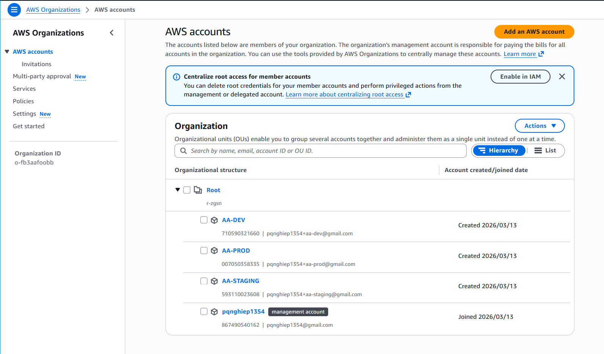

# AA_AWS_Practice_Nghiep_v2.md
## Adventure Asia — AWS DevOps Practice Working Notes
**Practitioner:** Nghiep (admin_nghiep)
**Mentor:** Shivam (QuanSkill)
**Guide Reference:** AAA_Practice_StepByStep_Guide.md (10 Steps)
**AWS Region:** ap-southeast-1 (Singapore)
**Started:** 11/03/2026

---

## Environment Summary

| Item | Value |
|---|---|
| Management Account | 867490540162 (pqnghiep1354) |
| AA-DEV Account | 710590321660 |
| AA-STAGING Account | 593110023608 |
| AA-PROD Account | 007050358335 |
| Root ID | r-zgsn |
| SSO Instance ARN | arn:aws:sso:::instance/ssoins-8210d1d9b37ec22f |
| SSO Identity Store | d-9667a69473 |
| SSO Start URL | https://d-9667a69473.awsapps.com/start |
| SCP ID | p-qme9rmxr (AA-RegionLock-SEA) |

---

## Pre-Flight Checklist

| Tool | Version | Status |
|---|---|---|
| OS | Windows 11 + WSL2 (Ubuntu 22.04) | OK |
| Shell | Zsh (Oh My Zsh) | OK |
| Git | 2.x | OK |
| AWS CLI | v2 (Linux + Windows) | OK |
| Docker Desktop | 24.x (WSL2 engine) | OK |
| Node.js | v20 LTS (via NVM) | OK |
| VSCode | Latest + Extensions | OK |
| VSCode Default Terminal | Ubuntu (WSL) | OK |

---

## Step 1 — Create and Confirm Environments (Option A)

**Date:** 13/03/2026
**Time spent:** 150 minutes

### Decisions Made

- **Option A over Option B:** Chose separate AWS accounts immediately rather
  than starting with Option B and migrating later. Reason: client project
  going to production — proper isolation from day one is the right call.
  Mentor guide explicitly marks Option A as "Recommended."

- **Gmail alias trick for account emails:** Used `pqnghiep1354+aa-dev@gmail.com`,
  `+aa-staging`, `+aa-prod` as unique emails for each AWS account.
  All emails land in the same Gmail inbox.

- **Zsh over Bash:** Machine uses Zsh (Oh My Zsh). All config appended to
  `~/.zshrc` instead of `~/.bashrc`. Used `source ~/.zshrc` throughout.

- **AWS_PAGER disabled:** Added `export AWS_PAGER=""` to `~/.zshrc` to prevent
  output getting stuck in `less` pager.

- **IAM Identity Center region:** Switched Console to ap-southeast-1 BEFORE
  clicking Enable. Region cannot be changed after creation.

- **nghiep assigned both AA-Admin + AA-DevOps** on all 3 accounts:
  AA-Admin for full access when needed, AA-DevOps as the day-to-day role.

### Results

**1.1 — AWS Organizations:**
```
Feature set   : ALL
Master account: 867490540162
```

**1.2 — Member Accounts:**
```
AA-DEV     : 710590321660  ACTIVE
AA-STAGING : 593110023608  ACTIVE
AA-PROD    : 007050358335  ACTIVE
```

**1.3 — Organizational Units:**
```
Root (r-zgsn)
  Workloads
    Non-Production  ->  AA-DEV + AA-STAGING
    Production      ->  AA-PROD
```

**1.4 — Service Control Policy:**
```
Name   : AA-RegionLock-SEA
ID     : p-qme9rmxr
Targets: Non-Production OU + Production OU
Effect : Deny all regions except ap-southeast-1
```

**1.5 — IAM Identity Center:**
```
Instance ARN  : arn:aws:sso:::instance/ssoins-8210d1d9b37ec22f
Identity Store: d-9667a69473
Region        : ap-southeast-1

Users:
  nghiep  ->  ID: 896a151c-60c1-70f6-3235-3af3e738ab91
  shivam  ->  (pending Shivam email acceptance)

Permission Sets:
  AA-Admin    ->  ps-8210f3b57e3dd151  (1h session)
  AA-DevOps   ->  ps-821034db9a29e140  (8h session)
  AA-ReadOnly ->  ps-82102dc2b7bf9e52  (8h session)

Account Assignments (nghiep):
  AA-DEV     ->  AA-Admin + AA-DevOps
  AA-STAGING ->  AA-Admin + AA-DevOps
  AA-PROD    ->  AA-Admin + AA-DevOps
```

**1.6 — AWS CLI SSO Profiles verified:**
```
aws sts get-caller-identity --profile aa-dev
  -> Account: 710590321660  Role: AWSReservedSSO_AA-DevOps

aws sts get-caller-identity --profile aa-stg
  -> Account: 593110023608  Role: AWSReservedSSO_AA-DevOps

aws sts get-caller-identity --profile aa-prod
  -> Account: 007050358335  Role: AWSReservedSSO_AA-DevOps
```

**Aliases added to ~/.zshrc:**
```bash
alias aws-dev="aws --profile aa-dev"
alias aws-stg="aws --profile aa-stg"
alias aws-prod="aws --profile aa-prod"
```

**1.7 — Billing Alert:**
```
Budget name: AAA-Monthly-Total
Limit      : $50 USD/month
Alert at   : 80% ($40)
Email      : pqnghiep1354@gmail.com
```

### Screenshots Taken

- [ ] Screenshot 1.1 — AWS Organizations console: 4 accounts ACTIVE



- [ ] Screenshot 1.2 — OU structure: Workloads / Non-Production / Production


- [ ] Screenshot 1.3 — SCP AA-RegionLock-SEA Targets tab: 2 OUs attached


- [ ] Screenshot 1.4 — IAM Identity Center enabled, region ap-southeast-1
.png>)

- [ ] Screenshot 1.5 — Permission Sets list: AA-Admin, AA-DevOps, AA-ReadOnly


- [ ] Screenshot 1.6 — SSO Access Portal showing 3 account cards


- [ ] Screenshot 1.7 — Terminal: 3x sts get-caller-identity outputs


- [ ] Screenshot 1.8 — AWS Budgets: AAA-Monthly-Total budget created


### Issues Encountered

**Issue 1 — AlreadyInOrganizationException**
- Symptom: `aws organizations create-organization` returned error
- Cause: Organization already existed from a previous session
- Fix: Not a real error. Ran describe-organization to confirm existing setup
- Learning: Always check existing state before creating resources

**Issue 2 — PolicyTypeNotEnabledException when attaching SCP**
- Symptom: Cannot attach SCP policy to OU
- Cause: SERVICE_CONTROL_POLICY type not enabled on Root
- Fix: `aws organizations enable-policy-type --root-id $ROOT_ID --policy-type SERVICE_CONTROL_POLICY`
- Then re-ran attach commands successfully

**Issue 3 — IAM Identity Center default region was us-east-1**
- Symptom: Console showed "US East (N. Virginia)" on Enable page
- Risk: Cannot change region after enabling — would require full disable/re-enable
- Fix: Switched Console region to ap-southeast-1 BEFORE clicking Enable
- Prevention: Always verify Console region before creating any regional service

### Questions for Mentor

1. **nghiep has AA-Admin on AA-PROD** — is this too permissive for a DevOps
   engineer on the production account? Should AA-PROD be AA-DevOps only for
   day-to-day work, with AA-Admin requiring a separate explicit login?

2. **Shivam account assignments** — should Shivam have AA-Admin on all 3 accounts,
   or AA-Admin on PROD only with AA-DevOps on DEV/STG?

3. **SCP scope on Management Account** — does AA-RegionLock-SEA SCP apply to
   the Management Account (867490540162) as well, or only to member accounts?

4. **Per-account budgets** — should each member account (DEV/STG/PROD) have its
   own separate budget alert, or is one consolidated budget on the Management
   Account sufficient for this stage?

5. **AA-ReadOnly assignment** — Permission Set created but not assigned to anyone.
   Who should receive this role? Developers? QA team members?

---

## Step 2 — Enable MFA + Access Setup
(to be continued... )


## Overall Progress Tracker

| Step | Description | Status | Date Completed |
|---|---|---|---|
| 1 | Environments (AWS Organizations + SSO) | COMPLETE | 13/03/2026 |
| 2 | MFA + Access Setup | PENDING | |
| 3 | IAM Roles (6 roles + OIDC) | PENDING | |
| 4 | Network Baseline (VPC) | PENDING | |
| 5 | Container Registry (ECR) | PENDING | |
| 6 | ECS Cluster + Service (Fargate) | PENDING | |
| 7 | Secrets and Configuration | PENDING | |
| 8 | Observability (CloudWatch) | PENDING | |
| 9 | CI/CD Pipeline | PENDING | |
| 10 | Staging Gate to Production | PENDING | |

---

## Key Variables Reference

```bash
# Management Account (default profile)
export AA_MGMT_ACCOUNT=867490540162
export AA_DEV_ACCOUNT=710590321660
export AA_STG_ACCOUNT=593110023608
export AA_PROD_ACCOUNT=007050358335

# Organizations
export ROOT_ID=r-zgsn
export SCP_ID=p-qme9rmxr

# IAM Identity Center
export SSO_INSTANCE_ARN=arn:aws:sso:::instance/ssoins-8210d1d9b37ec22f
export SSO_IDENTITY_STORE=d-9667a69473

# Permission Sets
export PS_ADMIN=arn:aws:sso:::permissionSet/ssoins-8210d1d9b37ec22f/ps-8210f3b57e3dd151
export PS_DEVOPS=arn:aws:sso:::permissionSet/ssoins-8210d1d9b37ec22f/ps-821034db9a29e140
export PS_READONLY=arn:aws:sso:::permissionSet/ssoins-8210d1d9b37ec22f/ps-82102dc2b7bf9e52

# Users
export USER_NGHIEP=896a151c-60c1-70f6-3235-3af3e738ab91

# AWS Settings
export AWS_PAGER=""
export AWS_REGION=ap-southeast-1

# CLI Aliases
alias aws-dev="aws --profile aa-dev"
alias aws-stg="aws --profile aa-stg"
alias aws-prod="aws --profile aa-prod"
```

---

